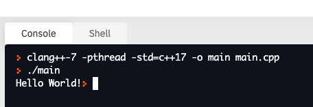

# C++ Quickstart

You can run a C++ program in an IDE of your choice. One simple way to get started is to use a web-based IDE.

1. Go to https://repl.it/.
2. Create an account and log in.
3. Click __+ New repl__.
4. Select __C++__ for the _language_.
5. Click __Create Repl__
6. Paste the below code into __main.cpp__

```c++
#include <iostream>
using namespace std;

int main() {
  cout << "Hello World!";
  return 0;
}
```

7. Click the __Run__ button at the top.
8. You should see the Console print out the following information:




