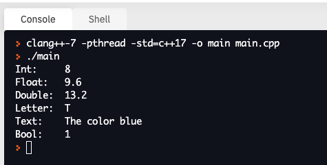

# 2. Variables

# Data types
A core advantage of programming is the ability to define variables and perform mathematical transforms. In C++, variables are defined according to data _types_. Data types are indicated by a predefined set of keywords that include __int__, __string__, __float__, __double__, __char__, and __bool__. All variables must have their type defined before they can be used. The following code demonstrates how variables can be defined.
```c++
#include <iostream>
using namespace std;

#include <string>

int main() {

  int myIntNum       = 8;                // Int is a number that has no decimal
  float myFloatNum   = 9.6;              // Float is a number with decimal
  double myDoubleNum = 13.2;             // Double is a number with decimal (like Float)
  char myLetter      = 'T';              // Char values are defined with single quotes
  string myText      = "The color blue"; // String values are defined with double qoutes
  bool myBool        = true;             // [true, false]

  // Printing out variables
  cout << "Int:     " << myIntNum   << endl;
  cout << "Float:   " << myFloatNum << endl;
  cout << "Double:  " << myDoubleNum << endl;
  cout << "Letter:  " << myLetter   << endl;
  cout << "Text:    " << myText     << endl;
  cout << "Bool:    " << myBool     << endl; // Note true and false will be printed as `1` or `0`.

  return 0;
}
```
The output of the above code results in:



There are 4 main data types:
  - _Character types_ (e.g. __char__, __string__): These define varibles that store characters such as 'T' and strings such as "color blue".
  - _Numerical integer types_ (e.g. __int__): These define variables that store whole number values such as `12` or `-4032`.
  - _Floating-point types_ (e.g. __float__, __double__): These define variables that store decimal numbers such as `3.2` or `-12.0`.
  - _Boolean type_ (e.g. __bool__): The define variables that store either `true` or `false`.

### Constants

Other keywords exist for defining variables.
```c++
const int numberOfDaysInWeek = 7;
```
In this example, using the `const` keyword when a variable is being defined does not allow the value of a variable to be overridden, but maintains it as a read-only variable after its declaration.

## Advantages to defining data types: memory efficiency and capturing intent
There are advantages to defining the specific data type that a variable can take on, one is that it can be more memory efficient for the machine to encode specific data types, the second advantages is that it helps us humans ensure we don't mistakenly cast inappropriate values to variables that were not intended to take on such a value. For example, we may want to record a string 'true' (such as a person's verbal response to an answer), rather than a boolean value `true`.

## References
- [C++ Variables Tutorial](http://www.cplusplus.com/doc/tutorial/variables/) contains more comprehensive information on variables and types.
