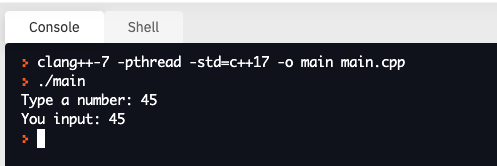

# 4. User Input

We've already looked at printing out statements, so it's also useful to know how to read data inputs. This is done with the `cin` keyword combined with the `>>` symbols. The example below demonstrates this.

```c++
#include <iostream>
using namespace std;

int main() {

  int value;
  
  // ask user to type a word
  cout << "Type a number: ";

  // read input
  cin >> value;

  // print out the value of the number input
  cout << "You input: " << value << "\n";
  
  return 0;
}
```

The output will look like this:


