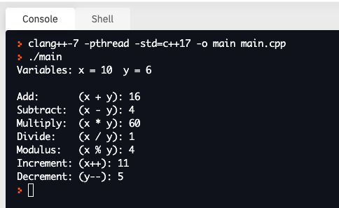
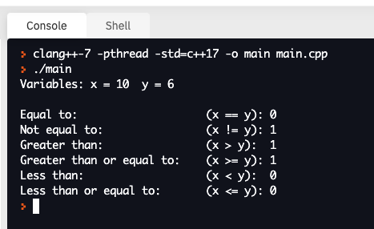
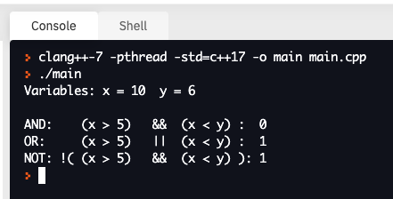

# 5. Operators


Now that we know how to define variables and types, we can perform mathematical manipulations and transforms. Specific symbols in C++ designate mathemitcal operations of addition, subtraction, multiplication, and division. The example below illustrates how these operations can be performed.

```c++
#include <iostream>
using namespace std;

int main(){

  int x = 10;
  int y = 6;

  cout << "Variables: x = " << x << "  y = " << y << endl;
  cout << endl;
  cout << "Add:       (x + y): " << x + y << endl;
  cout << "Subtract:  (x - y): " << x - y << endl;
  cout << "Multiply:  (x * y): " << x * y << endl;
  cout << "Divide:    (x / y): " << x / y << endl;
  cout << "Modulus:   (x % y): " << x % y << endl;

  // Note increment / decrement changes the variable value in-place;
  x++;
  cout << "Increment: (x++): " << x << endl;

  y--;
  cout << "Decrement: (y--): " << y << endl;

}
```
The above code yields the following output:



## Arithmetic (`+`, `-`, `/`, `*`,`%`)
In addition to standard mathematical operations (`+`, `-`, `/`, `*`), we can calculate the modulus with the `%` operator to return the remainder value of a division operation (5 % 3 = 2; a remainder of 2 when 5 is divided by 3).

## Increment (`++`) and Decrement (`--`)
As you get deep into programming, you will find that loops and counters play an important role in iterating through tasks with the statement `x = x + 1`. There is shorthand to this expression which is `x++`. Conversely, `x = x - 1` can be expressed as `x--`. With the increment / decrement operation there is no need to _reassign_ the new value to the same variable because the new variable is automatically updated.

## Assignments (`+=`, `-=`, `*=`, `/=`, `%=`)
There are short-hand ways to assign values to a variable, for a comprehensive list you may look [here](http://www.cplusplus.com/doc/tutorial/operators/). Here are some examples:

```c++
x += 3; // x = x + 3
x -= 3; // x = x - 3
x *= 3; // x = x * 3
x /= 3; // x = x / 3
x %= 3; // x = x % 3
```

## Comparisons (`==`, `!=`, `<`, `>`, `>=`, `<=`)
Programming often requires the use of logical operations to compare whether a statement is true or false. To faciliate this, comparison operators exist to perform this task, and is best shown in the following example:

```c++
#include <iostream>
using namespace std;

int main(){

  int x = 10;
  int y = 6;

  cout << "Variables: x = " << x << "  y = " << y << "\n\n";

  cout << "Equal to:                    (x == y): " << (x == y) << "\n";
  cout << "Not equal to:                (x != y): " << (x != y) << "\n";
  cout << "Greater than:                (x > y):  " << (x > y)  << "\n";
  cout << "Greater than or equal to:    (x >= y): " << (x >= y) << "\n";
  cout << "Less than:                   (x < y):  " << (x < y)  << "\n";
  cout << "Less than or equal to:       (x <= y): " << (x <= y) << "\n";

}
```



## Boolean Logic Operators

To perform operations with boolean logic, logical operators exist and are of three sets of symbols: `&&`, `||`, and `!`.

```c++
#include <iostream>
using namespace std;

int main(){

  int x = 10;
  int y = 6;

  cout << "Variables: x = " << x << "  y = " << y << "\n\n";

  // (x greater than 5) AND (x less than y)
  bool andOperator =  ((x > 5) && (x < y));
  
  // (x greater than 5) OR (x less than y)
  bool orOperator  =  ((x > 5) || (x < y));
  
  // NOT ((x greater than 5) AND (x less than y))
  bool notOperator = !((x > 5) && (x < y));

  cout << "AND:    (x > 5)   &&  (x < y) :  " <<  andOperator  << "\n";
  cout << "OR:     (x > 5)   ||  (x < y) :  " <<  orOperator   << "\n";
  cout << "NOT: !( (x > 5)   &&  (x < y) ): " <<  notOperator  << "\n";

}
```



Boolean logic is a set of comparison rules for binary values (`true` and `false`). Here is a summary of those rules.

| a                                     | b                                     | a `&&` b                              | a `\|\|` b                              |
| ------------------------------------- | ------------------------------------- | ------------------------------------- | ------------------------------------- |
| <span style="color: blue">_true_</span> | <span style="color: blue">_true_</span> | <span style="color: blue">_true_</span> | <span style="color: blue">_true_</span> |
| <span style="color: blue">_true_</span> | <span style="color: red">__false__</span> | <span style="color: red">__false__</span> | <span style="color: blue">_true_</span> |
| <span style="color: red">__false__</span> | <span style="color: blue">_true_</span> | <span style="color: red">__false__</span> | <span style="color: blue">_true_</span> |
| <span style="color: red">__false__</span> | <span style="color: red">__false__</span> | <span style="color: red">__false__</span> | <span style="color: red">__false__</span> |

# References
- [C++ Operators Tutorial](http://www.cplusplus.com/doc/tutorial/operators/) contains a comprehensive list of operators.
