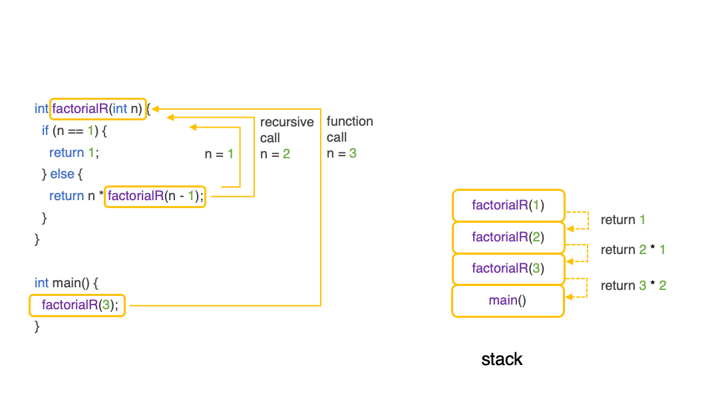

# 2. Recursion

It is possible for a function to call itself, this is called recursion. Let us consider the example where we want to compute the factorial of a number, which is defined by:
```
n! = 1 * 2 * 3 * ... n
``` 

One way to solve for this is to perform a for loop:
```c++
#include <iostream>
using namespace std;

int factorial(int n){

  int result = 1;
  for (int i=1; i <= n; i++) {
    result *= i;
  }
  
  return result;
}

int main(){  

  int result = factorial(4);
  cout << result << "\n";

}
// 24
```

A recursive solution would be as follows:
```c++
#include <iostream>
using namespace std;

int factorial(int n) {

    if (n == 1) {
       return 1;  
    } else {
      return n * factorial(n - 1);
    }

}

int main(){  

  int result = factorial(4);
  cout << result << "\n";

}
// 24
```
With the factorial calculation solved as a recursive function, the function is calling itself with decrementing values of `n`, until the value 1 has been reached. If you were to formally expand the recursive function executions, it would look like this:
```
factorial(n = 4)
  (n > 1) therefore 4 * factorial(3);

factorial(n = 3)
  (n > 1) therefore 3 * factorial(2);

factorial(n = 2)
   (n > 1) therefore 2 * factorial(1);
   
factorial(n = 1)
    return 1;
    
factorial(n = 2)
    return 2 * 1;
    
factorial(n = 3)
    return 3 * 2;
    
factorial(n = 4)
    return 4 * 6;
```
It can take a while to absorb how a function can call itself to solve for an outcome. When constructing a function you have to keep in mind that end condition that stops the function from calling itself, so it can return the answers back up the chain of the recursive function calls. In our above example, the condition that stops the recursion was reaching `n == 1`.




# Reference
- [C++ Recursion - programiz.com](https://www.programiz.com/cpp-programming/recursion)
- [Recursion the Pros and Cons - medium.com](https://medium.com/@williambdale/recursion-the-pros-and-cons-76d32d75973a)
