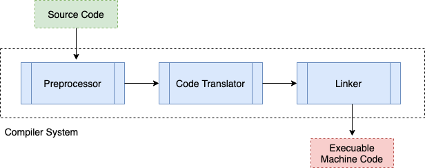

# Compiler Operation
By now, you've become very used to clicking __Run__ to execute your main code. Let's explore how your C++ code is processed, because having some intuition behind this process may help you structure and debug code better. 

```c++
#include <iostream>
using namespace std;

int main() {
  cout << "Hello World!";
  return 0;
}
```
The above code yields the output below in the [repl.it](repl.it) console.


If you have been using the [repl.it](repl.it) interface, you may have noticed this first line: `clang++-7 -pthread -std=c++17 -o main main.cpp`. This is the single command that takes your _main.cpp_ code and converts the code into machine code to execute it.

## Compiler System: Preprocessor, Code Translator, and Linker
The compilation of a program from _.cpp_ code into machine executable code is of three components: __preprocessor__, __code translator__, and __linker__.



### 1. Preprocessor
The __preprocessor__ parses the code to convert your _main.cpp_ into a purely C++ code. So lines of code that are directives such as `#include <iostream>` or header files `function.h` tell the processor to open up the _.cpp_ files they are refering to, and copy and paste the code into the _main.cpp_. You can take a look at what the preprocessor generates from your terminal (shell in [repl.it](repl.it)) with:
```bash
cpp main.cpp > main.i
```

If you inspect _main.i_ you will find the file to be hundreds of lines long with extensive amount of C++ code that was imported from the `#` directives and `.h` files. You'll find the code you composed in _main.cpp_ at the end of the file. Note that __cpp__ is a C language preprocessor.

### 2. Code Translator
The __code translator__ (also refered to as compiler) converts the pure C++ code into machine readable code. The machine readable code is stored in "object" files (_.o_ extension in Linux/Mac, and _.obj_ extension in Windows). You can take a look at these object files by running the following command in the terminal (shell in [repl.it](repl.it)):
```bash
clang++-7 -c -o main.o main.cpp 
```
- `clang++-7` is a C++ compiler (alternatively you may use __g++__).
- `-c` option defines to output an object file (_.o_).
- `-o main.o` is the output file name.
- `main.cpp` is the file to be compiled.

If you open the resulting _main.o_ file, you will see that it isn't human readable since it is machine code. It may look something like below.
```
�H�E�H)�H�]�UH�H�H�}�H�E�H�H�=� �
�H�5�H�
       �UH�H��}�u�}�u2�}�u)H�=� �O�H�� H�5� H�b H�UH���]�UH�H��}�}�u���E���E�UH�H��}�u�}�u2�}�u)H�=. �H�� H�5�� H��UH���]ÐAWAVI�AUATL�%.
             UH�-F
                   SA�I�L)�HH��H�t 1��L�L�D�A��H�H9�u�H[]A\A]A^A_Ðf.��HH�%d
```

### 3. Linker
The __linker__ is the final step in the compilation process, as it combines all the object files together into a single executable file. The linking step can be performed with the following command in the terminal (shell in [repl.it](repl.it)):
```bash
clang++-7 -o main main.o
```
- `clang++-7` is a C++ compiler (alternatively you may use __g++__).
- `-o main` is the output file name (on Windows it will be an _.exe_ file).
- `main.o` is the input (object) file name.

Once the object files have been linked, you can run your compiled code from the terminal ([repl.it](repl.it)) in the following way:
```bash
./main
```

### Compilation in one-step
To compile from the _.cpp_ source code straight to the executable, you can run the following command your terminal (shell in [repl.it](repl.it)).
```bash
clang++-7 main.cpp -o main
```
- `clang++-7` is a C++ compiler (alternatively you may use __g++__).
- `main.cpp` is the input (source) file name.
- `-o main` is the output file name (on Windows it will be an _.exe_ file).


### Summary Diagram: Compiling with Multiple `.cpp` Source Files
The steps described above can be viewed visually in the diagram below. The diagram below demonstrates the compiler flow when more than just a single _main.cpp_ exists in the project. We can see that for each _.cpp_ there is a seperate preprocesser and code translator processing step (i.e. _file2.cpp_ and _main.cpp_ have seperate steps), with the linker combining all object files into a final executable file.


# References:
- [Makefile in C and its applications - geeksforgeeks.org](https://www.geeksforgeeks.org/makefile-in-c-and-its-applications/)
- [Compiling a basic Make file for compiling C code - codeproject.com](https://www.codeproject.com/Articles/794764/Creating-A-Basic-Make-File-for-Compiling-C-Code)
- [Make tutorial - courses.engr.illinois.edu](https://courses.engr.illinois.edu/cs225/fa2018/resources/maketutorial/)
- [GCC and Male - ntu.edu.sg](https://www3.ntu.edu.sg/home/ehchua/programming/cpp/gcc_make.html)
- [C++ Compiler Operation - icarus.cs.weber.edu](http://icarus.cs.weber.edu/~dab/cs1410/textbook/1.Basics/compiler_op.html)
- [Pre-processed .i files - viva64.com](https://www.viva64.com/en/t/0076/)


